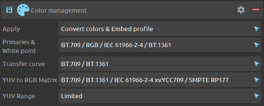

# Manage and convert color spaces

Depending on the file format and pixel format of the input and output medias, *DuME* tries to automatically manage and convert colors. If you need specific color profiles, you can also set you own parameters.

[TOC]

## Color spaces in *DuME*

Color spaces are usually represented as three independant parameters:

- ***Primaries*** define how the primary color of each channel should be represented. i.e. how should be represented the perfect red, green and blue colors in an RGB color space.
- The ***White Point*** defines the exact color of what is considered full white in this color space.
- The ***Transfer curve*** defines how the values from black to white (levels) are interpolated. It is sometimes referred as *gamma* but it is not exactly a gamma curve, although a simple gamma can give an approximation of this transfer curve.

In *DuME*, the primaries and the white point are set together with the same parameter, which means the color profiles used by *DuME* have only two parameters: ***Primaries*** and ***Transfer curve***.

*DuME* also associates with the color spaces a conversion Matrix to convert between the *YUV* and *RGB* spaces.

Finally, when working in the *YUV* space, a fourth settings sets if the range is ***full*** or ***limited***. In an 8 bit full range, values for each channel range from `0` to `255` whereas in the limited range, values are constrained to the `16-235` range.

### Color profile (presets) definitions

This is the list of color profiles (i.e. presets) in *DuME* and their default parameters

| Profile name | Primaries | Transfer curve | Matrix | Range |
| --- | --- | --- | --- | --- |
| Images (sRGB) | BT.709 / RGB / IEC 61966-2-4 | sRGB / IEC 61966-2-1 | RGB | Full |
| HD Video (BT.709) | BT.709 / RGB / IEC 61966-2-4 | BT.709 | BT.709 | Limited |
| UHD Video | BT.2020 | BT.2020 10 bit | BT.2020 CL | Full |
| UHD HDR Video | BT.2020 | BT.2020 12 bit | BT.2020 CL | Full |
| Display P3 | P3 D65 | sRGB / IEC 61966-2-1 | RGB | Full |
| DCI P3 | DCI P3 | DCI P3 (gamma 2.6) | RGB | Full |
| Linear RGB | BT.709 / RGB / IEC 61966-2-4 | Linear | RGB | Full |
| PAL / SECAM | PAL & SECAM / BT.470 BG / BT.601 | PAL & SECAM / BT.470 M | PAL & SECAM | Limited |
| NTSC | NTSC / BT.601 | NTSC / BT.601 | NTSC | Limited |

!!! note
    This list may be adjusted in future versions.  
    If you feel these default values could be improved, or other ones added, please [post your suggestions](https://github.com/Rainbox-dev/DuME/issues/new/choose) here.

## Automatic color conversion by *DuME*

When all color parameters are left to their default values, here is what *DuME* does:

- If the input and output pixel formats and profiles are the same, there is no conversion.
- If one of the profiles or pixel format differ, *DuME* automatically converts the colors and sets the color profile, according to the following defaults.

Here are the default values used by *DuME*, depending on the container or the pixel format, sorted by priority.

- *OpenEXR* `.exr` files: ***Linear RGB***.
- In general, all *Image sequences*: ***sRGB***.
- *MP4* `.mp4` or *WebM* `.webm` files: ***BT.709***
- *RGB* pixels, with 32bpc: ***Linear RGB***
- *RGB* pixels, with less than 32bpc: ***sRGB***
- *YUV* pixels: ***BT.709***

!!! note
    This list may be adjusted in future versions.  
    If you feel these default values could be improved, or other ones added, please [post your suggestions](https://github.com/Rainbox-dev/DuME/issues/new/choose) here.

## Input color interpretation

If *DuME* does not correctly detect the colors from the input media (or if they're no standard) and the above default values do not correspond to your media file, you can set the interpretation of the input medias.

You can quickly set all values to a specific color space by selecting a preset in the options.

For any specific parameter, if you don't know what to choose, leave it on *Auto*.

## Output color conversion

*DuME* tries to automatically manage and convert the colors of the input media depending on the output format. If you need, you can force it to convert to or set a specific color space.

The first parameter "*Apply*" can change the way *DuME* manages the colors. By default, it will both convert the colors and try to set the metadata in the output file (embed color profile). You can also set it to just convert the colors, or to just add the metadata.

You can quickly set all values to a specific color space by selecting a preset in the options.

For any specific parameter, if you don't know what to choose, leave it on *Auto*.